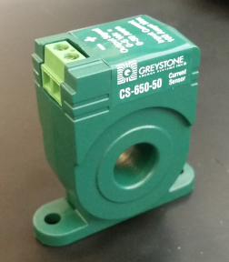

Page\: `More -> Energy Usage`

There are two methods for calculating energy usage. The first relies on determining how long Outputs have been on. Based on this, if the number of Amps the output draws has been set in the output Settings, then the kWh and cost can be calculated. Discovering the number of amps the device draws can be accomplished by calculating this from the output typically given as watts on the device label, or with the use of a current clamp while the device is operating. The limitation of this method is PWM Outputs are not currently used to calculate these figures due to the difficulty determining the current consumption of devices driven by PWM signals.

The second method for calculating energy consumption is more accurate and is the recommended method if you desire the most accurate estimation of energy consumption and cost. This method relies on an Input or Math measuring Amps. One way to do this is with the used of an analog-to-digital converter (ADC) that converts the voltage output from a transformer into current (Amps). One wire from the AC line that powers your device(s) passes thorough the transformer and the device converts the current that passes through that wire into a voltage that corresponds to the amperage. For instance, the below sensor converts 0 -50 amps input to 0 - 5 volts output. An ADC receives this output as its input. One would set this conversion range in Mycodo and the calculated amperage will be stored. On the Energy Usage page, add this ADC Input measurement and a report summary will be generated. Keep in mind that for a particular period (for example, the past week) to be accurate, there needs to be a constant measurement of amps at a periodic rate. The faster the rate the more accurate the calculation will be. This is due to the amperage measurements being averaged for this period prior to calculating kWh and cost. If there is any time turing this period where amp measurements aren't being acquired when in fact there are devices consuming current, the calculation is likely to not be accurate.

[Greystone CS-650-50 AC Solid Core Current Sensor (Transformer)](https://shop.greystoneenergy.com/shop/cs-sensor-series-ac-solid-core-current-sensor)

The following settings are for calculating energy usage from an amp measurement. For calculating based on Output duration, see [Energy Usage Settings](Configuration-Settings/#energy-usage-settings).

<table>
<thead>
<tr class="header">
<th>Setting</th>
<th>Description</th>
</tr>
</thead>
<tbody>
<tr>
<td>Select Amp Measurement</td>
<td>This is a measurement with the amp (A) units that will be used to calculate energy usage.</td>
</tr>
</tbody>
</table>